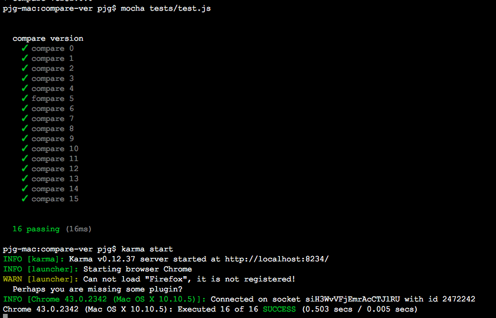

# 用充分利用递归实现一个软件版本对比的思路分析
-------

最近在做可视化的前端模板管理项目时，需要重新开发一个前端组件的开发构建和发布框架，而在构建发布环节涉及一个模块版本对比管理的问题——

希望实现类似npm的版本发布机制，每次提交只能提交的版本不能低于当前版本，而且这个对比的工具在前端加载资源时要用到。

也就是说，除了此版本对比工具要能在Nodejs环境下运行，同时需要兼容主流的浏览器，最好是IE6以上都兼容。

## 版本的规则
```
//规则
{num}.{num}. …… {num}.{num}

//例如
"1.7" < "1.7.1" < "1.7.10" < "1.7.10.01" < "1.7.0.10.010"
"1.0" < "1.0.1" < "2.0" < "2.0.0.1" < "2.0.1"
"1.0.0.0" < "1.0.1.0" < "2.0.0.0" < "2.0.0.1" < "2.0.1.0"
……
```

实际上，如果是php开发，这就不是什么问题，因为它有语言基本函数级别的实现——[version-compare](http://php.net/manual/zh/function.version-compare.php)。基本上和我的需求差不多，但Javascript显然是没有的。

本着不造轮子的原则，在`stackoverflow`上找了一下，发现一个基本同样的需求：
http://stackoverflow.com/questions/6832596，上面有很多不同的实现方法。

先来看看别人的实现。

## 得票最多的实现
```javascript
function versionCompare(v1, v2, options) {
    var lexicographical = options && options.lexicographical,
        zeroExtend = options && options.zeroExtend,
        v1parts = v1.split('.'),
        v2parts = v2.split('.');
    function isValidPart(x) {
        return (lexicographical ? /^\d+[A-Za-z]*$/ : /^\d+$/).test(x);
    }
    if (!v1parts.every(isValidPart) || !v2parts.every(isValidPart)) {
        return NaN;
    }
    if (zeroExtend) {
        while (v1parts.length < v2parts.length) v1parts.push("0");
        while (v2parts.length < v1parts.length) v2parts.push("0");
    }
    if (!lexicographical) {
        v1parts = v1parts.map(Number);
        v2parts = v2parts.map(Number);
    }
    for (var i = 0; i < v1parts.length; ++i) {
        if (v2parts.length == i) {
            return 1;
        }
        if (v1parts[i] == v2parts[i]) {
            continue;
        }else if (v1parts[i] > v2parts[i]) {
            return 1;
        }else {
            return -1;
        }
    }
    if (v1parts.length != v2parts.length) {
        return -1;
    }
    return 0;
}
```
这个实现利用 `Array.every` 和 `Array.map` 两个Api，也就是这个实现只能在IE9以上的现代浏览器上运行，明显不太符合我的需求。

不过，这一实现的作者在github写了比较完整的测试用例（https://github.com/gabe0x02/version_compare），覆盖率还是很高的，如果只需要在现代浏览器或Nodejs环境上运行，这一实现还是比较靠谱的。


## 第二种实现
```javascript
// Return 1 if a > b
// Return -1 if a < b
// Return 0 if a == b
function compare(a, b) {
    if (a === b) {
        return 0;
    }
    var a_components = a.split(".");
    var b_components = b.split(".");
    var len = Math.min(a_components.length, b_components.length);
    // loop while the components are equal
    for (var i = 0; i < len; i++) {
        // A bigger than B
        if (parseInt(a_components[i]) > parseInt(b_components[i])) {
            return 1;
        }
        // B bigger than A
        if (parseInt(a_components[i]) < parseInt(b_components[i])) {
            return -1;
        }
    }
    // If one's a prefix of the other, the longer one is greater.
    if (a_components.length > b_components.length) {
        return 1;
    }
    if (a_components.length < b_components.length) {
        return -1;
    }
    // Otherwise they are the same.
    return 0;
}
```
这个版本的实现得票也比较高。优点就是没有兼容问题，如果要求不高，其实这个实现是能用。

不过，如果要求高一些，这个实现还是很脆弱的，因为核心的思路就是利用循环逐个对比，然后同位元素用 `parseInt` 取整后对比大小，但如果版本中包含了前置`0`时就不符合预期了。

例如：
```
compare("1.0.0", "1.0.00") //0
compare("1.0.01", "1.0.001") //0
compare("1.0.1", "1.0.001") //0
```

此外，这个实现没有太多的前置条件判断，很多异常输入条件时很容易报错，不太靠谱。

继续找实现方案……


## 第三种实现

在 `stackoverflow` 还有人提供了一个 npm 模块 [Semver](https://www.npmjs.com/package/semver)，也得了一些投票，看了以该模块的安装和下载量，非常多人使用，于是将该模块安装到本地：
```
npm install semver
```
用法如下：
```
var semver = require('semver');

semver.diff('3.4.5', '4.3.7') //'major'
semver.diff('3.4.5', '3.3.7') //'minor'
semver.gte('3.4.8', '3.4.7') //true
semver.ltr('3.4.8', '3.4.7') //false

semver.valid('1.2.3') // '1.2.3'
semver.valid('a.b.c') // null
semver.clean(' =v1.2.3 ') // '1.2.3'
semver.satisfies('1.2.3', '1.x || >=2.5.0 || 5.0.0 - 7.2.3') // true
semver.gt('1.2.3', '9.8.7') // false
semver.lt('1.2.3', '9.8.7') // true

var versions = [ '1.2.3', '3.4.5', '1.0.2' ]
var max = versions.sort(semver.rcompare)[0]
var min = versions.sort(semver.compare)[0]
var max = semver.maxSatisfying(versions, '*')
```

`semver` 提供了很多不同的比较接口，功能强大。

研究了一下`semver`的源码和测试用例，非常强悍。这时才发现它就是npm的官方实现！也就是，我们在提交和下载npm模块时，判断版本是否符合要求的常用模块，因此下载量才那么恐怖。

不过，这个实现的体积太过庞大了，源码超过了1100行，毕竟它不是针对浏览器环境而开发的，因此也不符合我的需求。

找了好久没有发现合适的，没办法只好自己写一个了。


## 版本对比实现的思路分析和代码分解

在之前我能找到的所有实现中，无一不是使用for循环迭代的方式来实现的，没有发现使用递归的方式。其实，我个人不太喜欢用没完没了的for循环，因为当条件很多的时候，for循环很难控制迭代次数，而导致效率低下，而使用递归则更容易控制一些。

正好之前整理数组去重的算法时，总结了一个使用递归来处理数组排重的方法，非常好用，而且是我个人认为的，效率最高且兼容最好的实现方法：

```javascript
/**
 * 数组去重【一维数组】
 * @param {Array} arr 需要去重的数组
 * @return {Array}
 * @兼容性： PC: IE 6+ & Mobile All
 */
var unique = function(arr) {
    var newArr = [];
    var temp = {};
    var _unique = function() {
        var _num = arr.shift();
        var key = typeof _num == "string" ? "_" + _num : _num;
        if (!temp[key]) {
            temp[key] = 1;
            newArr.push(_num);
        }
        arr.length > 0 && _unique();
    };
    _unique();
    return newArr;
};
```
高效是因为只用了 Array.shift 这个原生Api来获取一个出栈的元素，并利用对象属性来判断元素是否重复，然后递归出栈后返回的数组，直到没有可以出栈的元素为止。下面的软件版本对比实现就是借鉴了这一思路。

### 递归实现版本对比的第1版
```CoffeeScript
# newVer表示最新输入的版本，oldVer表示原来的版本
compareVer = (newVer,oldVer)->
	# 如果两个输入条件完全相等，直接返回 0，表示相等
    if newVer == oldVer
        return = 0
    else
        isTrue = -1 # 假设原来的版本值更大
        newArr = newVer.split('.')
        oldArr = oldVer.split('.')
        compareNum = ->
	        # 每次递归均将newArr的第一个元素出栈并取整
            _new = ~~newArr.shift()
            # 每次递归均将oldArr的第一个元素出栈并取整
            _old = ~~oldArr.shift()
            # 当新版本的首个同位值大于原版，
            # 则isTrue赋值 1，表示新输入的版本值更大
            _new > _old && isTrue = 1
            # 如果同位元素值相等，
            # 并且出栈后剩余的数组还有元素，则递归
            _new == _old && newArr.length > 0 && compareNum()
        compareNum()
        return isTrue
```
假定，所有的输入条件均是合法的，并且版本分组长度均一致的情况下是没问题的，以下的用例都可以通过

```CoffeeScript
compareVer("1.7.2", "1.7.1").should.equal(1)
compareVer("1.7.10", "1.7.1").should.equal(1)
compareVer("1.8.0", "1.7.10").should.equal(1)

compareVer("1.7", "1.7").should.equal(0)
compareVer("1.7.0", "1.7.0").should.equal(0)
compareVer("1.7.10", "1.7.10").should.equal(0)

compareVer("1.7.1", "1.7.10").should.equal(-1)
compareVer("1.7.2", "1.7.10").should.equal(-1)
compareVer("1.6.1", "1.7.10").should.equal(-1)
compareVer("1.6", "1.7.10").should.equal(-1)
compareVer("1.6.10", "1.7.10.0").should.equal(-1)
compareVer("1.6.20", "1.7.10").should.equal(-1)

compareVer("1.7.0.0", "1.7.0.0").should.equal(0)
compareVer("1.7.00", "1.7.00").should.equal(0)
compareVer("1.70.00", "1.70.00").should.equal(0)

compareVer("1.7.20", "1.7.10").should.greaterThan(0)
compareVer("1.7.10", "1.7.1").should.greaterThan(0)
compareVer("1.7.10", "1.6.1").should.greaterThan(0)
compareVer("1.7.10", "1.6.20").should.greaterThan(0)
```

我们无法假定版本都是按照 `{num}.{num}.{num}` 的规则输入的，并且{num} 可以是 `01`、`001`、`00`这样的组合，而且当两个对比的版本分组长度不一致时，这个就没法检测了。

例如：

```CoffeeScript
compareVer("1.7.0", "1.7").should.equal(1)
compareVer("1.8.0", "1.7").should.equal(1)
```

事实上，我们希望`"1.7.0" > "1.7"` 是成立，因为1.7.0 的版本精度更高，应该算是一个新的版本，而且我们希望`"1.7.00" > "1.7.0"` 也是成立的，依此类推。

### 长度不一致时的，对比策略分析
当我们把版本 `.` 切割为数组时，以下的不同长度的结果均是可能的：
```CoffeeScript
newArr = [1,7,0]
oldArr = [1,7]

# or
newArr = [1,7]
oldArr = [1,7,0]

# or
newArr = [1,7,1]
oldArr = [1,7,1,0,0,0]
# or
newArr = [1,7,1,0]
oldArr = [1,7,1,0,0,00]

# ……
```
当切割后的数组长度不一致时，上面的递归实现方法就存在没有完全对比的情形，因此，在对比之前，我们要给长度短的数组，按位补 `0`，然后再对比。

例如：
```CoffeeScript
newArr = [1,7,1] -> [1,7,1,0,0,0]
oldArr = [1,7,1,0,0,0]

# or
newArr = [1,7,1,0,0,1]
oldArr = [1,7,1] -> [1,7,1,0,0,0]
```
从对比，可以发现有几种情况：

1. 两个数据的长度并不知道谁更长，因此首先要计算谁更长
2. 补零的次数是两个数组的长度之差，但这个次数是不可知
3. 补零后，即便两者完全相等，但数组长度大的还是表示更新的版本

### 递归实现版本对比的第2版

由于补零次数是未知的，但迭代终止的条件是可计算的（即两则的长度差），用 递归 或 循环迭代 都是可以的，在这里还是充分利用递归，坚持不用for或while……

#### 数组递归补零
```CoffeeScript
newArr = newVer.split('.')
oldArr = oldVer.split('.')

newLen = newArr.length # 缓存数组长度
oldLen = oldArr.length # 缓存数组长度
maxLen = Math.max(newLen,oldLen) # 获取最大长度

# 递归补零
zerofill = ->
	# 如果 newArr 的长度更短，则补零
	# 每次递归后newArr或oldArr的长度会发生变化，所以不能用缓存
	newArr.length < maxLen && newArr.push('0')
	# 如果 oldArr 的长度更短，则补零
	oldArr.length < maxLen && oldArr.push('0')
	# 如果补零后，新旧素组的长度还是不一样，则递归继续补零
	newArr.length != oldArr.length && zerofill()

# 需要补零的前置条件是两个数组的长度不一样
newLen != oldLen && zerofill()
```

补零完成之后，我们要首先处理这个问题——`如果两者完全相等，但数组长度大的还是表示更新的版本`。

也就是，如何判断两个数组完全相等，这个问题很容易，只要把两者还原成字符串对比即可，方法很多：
```
newArr.join() == oldArr.join()
newArr.toString() == oldArr.toString()
```

#### 先递归补零，然后再递归同位对比
那么，有了这个补零的处理，那么递归实现版本对比的代码如下：

```CoffeeScript
compareVer = (newVer,oldVer)->
    # 如果两个输入条件完全相等，直接返回 0，表示相等
    if newVer == oldVer
        return 0
    else
        newArr = newVer.split('.')
        oldArr = oldVer.split('.')
        newLen = newArr.length
        oldLen = oldArr.length
        maxLen = Math.max(newLen,oldLen)
        zerofill = ->
            newArr.length < maxLen && newArr.push('0')
            oldArr.length < maxLen && oldArr.push('0')
            newArr.length != oldArr.length && zerofill()
        newLen != oldLen && zerofill()
        if newArr.toString() == oldArr.toString()
    	    # 排除补零后，两个数组完全相等的情况
            return if newLen > oldLen then 1 else -1
        else
            isTrue = -1
            compareNum = ->
                _new = ~~newArr.shift()
                _old = ~~oldArr.shift()
                _new > _old && isTrue = 1
                _new == _old && newArr.length > 0 && compareNum()
            compareNum()
            return isTrue
```

#### ‘补零+同位对比’ 存在隐患

在这个过程中，进行同位对比时我们对同位元素进行了取整（两次 `~~` `按位NOT` ），取整后就可能存在不准确的可能。

关于 `~~`的数字运算与 `parseInt`的一致性研究可以参考以下的文章：
>	- [javascript中 ~~ 运算符的特性研究](http://pjg.pw/web-front-end/value-of-NOT-NOT-operator.html)
>	- [javascript中 ~~ 运算符的特性研究2](http://pjg.pw/javascript/value-of-NOT-NOT-operator-2.html)

例如：

```
compareVer("1.0.07", "1.0.7").should.equal(-1)
```

在这个情况中，因为`~~07 === ~~7`是成立，但我们期望的结果是 `07 < 7`，因为如果我们把版本当数字来对待时，`1.07 < 1.7`是成立的，这才是符合逻辑的。

但是由于设定了一个前提——假设两个版本是不相等 ，`isTrue = -1` 或 `isTrue = 1`，同位对比时不存在 `isTrue = 0` 的结果，只有两者在字符串对比状态下完全相等，才可能是相等的，因此这一隐患就被避免掉了。

不过，这个情况出现在第一组数据时就有问题了。比如以下的测试用例就无法通过：
```
compareVer("01.0.7", "1.0.7").should.equal(0)
compareVer("1.0.7", "01.0.7").should.equal(0)
```

针对这个情况，我们要做设定一些前置条件——版本的首位数字组合的可以为 0，但按照数字对比的原则，我们期望以下的版本对此是成立的：
```
"01.0" == "1.0"
"01.0" == "1.0"
"01.0.0" == "1.0.0"
```
因此，我们在对比判断时，如果字符串的首位为 `0`，则替换为空。此外，为了让代码更强壮，还需要对输入条件进行一些前置判断。

归纳总结，前置条件包括：

1. 对比的版本是2个，多一个少一个都是不符合预期的
2. 处理的版本格式要符合`{num}. …… .{num}` 的规则
3. 输入的处理对象必须为字符串，而不能是其他的类型
4. 字符串的首位为 `0`，则替换为空
5. 兼容nodejs和浏览器两种不同的环境

### 兼容NodeJS和浏览器的版本对比函数的完整实现
```CoffeeScript
###*
* Compares two software version numbers (only number)
*
* This function was born in http://stackoverflow.com/a/6832721.
* @parse string newVer (e.g. "1.7" or "1.2.1").
* @parse string oldVer (e.g. "1.7" or "1.2.1").
* @return <,return -1
*         =,return 0
*         >,return 1
*         error, return < -1
###
((root, factory)->
    if typeof exports == 'object'
        module.exports = factory()
    else if typeof define == 'function' && define.amd
        define(factory)
    else
        root.compareVer = factory()
)(this, ->
    'use strict'
    _compareVer = (newVer,oldVer)->
        VER_RE = /(\d+\.){1,9}\d+/
        if arguments.length != 2
          return -100
        if typeof newVer != 'string'
            return -2
        if typeof oldVer != 'string'
            return -3
        newMatch = newVer.match(VER_RE)
        if not newMatch or newMatch[0] != newVer
            return -4
        oldMatch = oldVer.match(VER_RE)
        if not oldMatch or oldMatch[0] != oldVer
            return -5

        newVer = newVer.replace(/^0/,'')
        oldVer = oldVer.replace(/^0/,'')
        if newVer == oldVer
            return 0
        else
            newArr = newVer.split('.')
            oldArr = oldVer.split('.')
            newLen = newArr.length
            oldLen = oldArr.length
            maxLen = Math.max(newLen,oldLen)
            zerofill = ->
                newArr.length < maxLen && newArr.push('0')
                oldArr.length < maxLen && oldArr.push('0')
                newArr.length != oldArr.length && zerofill()
            newLen != oldLen && zerofill()
            if newArr.toString() == oldArr.toString()
                return if newLen > oldLen then 1 else -1
            else
                isTrue = -1
                compareNum = ->
                    _new = ~~newArr.shift()
                    _old = ~~oldArr.shift()
                    _new > _old && isTrue = 1
                    _new == _old && newArr.length > 0 && compareNum()
                compareNum()
                return isTrue
    return _compareVer
)
```

## 写在最后

为了实现一个最初觉得很简单的工具函数，然后把实现思路整理并形成这篇文章，花了俺一整天的时间。不过，总体还是有收获的，特别是为了在测试用例上花了很多功夫……

一开始没有考虑周全，一边写框架，一边自己手工测试，经常发现想不到的异常情况。没办法就去写了测试用例，发现无法通过测试，只好回过头去修改这个函数的逻辑代码。反反复复，所以花了很多时间。因此，在写程序前，应该多花一些时间来思考，很多时候思考的时间远比写代码的时间长，甚至可以先写测试用例，然后再去完成代码逻辑都是可以的。

总之，再小函数功能的实现，测试用例要花点心思在这上面，而且要尽可能覆盖全面一些，这样代码的质量才会有保障。

最后，附上本函数的测试全部用例：

```CoffeeScript
if typeof require == 'function'
    should = require('should')
    compareVer = require('../index')
describe 'compare version', ->
    it 'compare 0', ->
        compareVer("1.7.2","1.7.1").should.equal(1)
        compareVer("1.7.10","1.7.1").should.equal(1)
        compareVer("1.8.0", "1.7.10").should.equal(1)

    it 'compare 1', ->
        compareVer("1.7.0", "1.7").should.equal(1)
        compareVer("1.8.0", "1.7").should.equal(1)

    it 'compare 2', ->
        compareVer("1.7.1", "1.7.10").should.equal(-1)
        compareVer("1.7.2", "1.7.10").should.equal(-1)
        compareVer("1.6.1", "1.7.10").should.equal(-1)

    it 'compare 3', ->
        compareVer("1.7", "1.7").should.equal(0)
        compareVer("1.7.0", "1.7.0").should.equal(0)
        compareVer("1.7.10", "1.7.10").should.equal(0)

    it 'compare 4', ->
        compareVer("1.6", "1.7.10").should.equal(-1)
        compareVer("1.6.10", "1.7.10.0").should.equal(-1)
        compareVer("1.6.20", "1.7.10").should.equal(-1)

    it 'fompare 5', ->
        compareVer("1.7.1", "1.7.10").should.equal(-1)
        compareVer("1.7", "1.7.0").should.equal(-1)
        compareVer("1.7", "1.8.0").should.equal(-1)
        compareVer("1.7.0", "1.7.00").should.equal(-1)

    it 'compare 6', ->
        compareVer("1.7.0.0", "1.7.0.0").should.equal(0)
        compareVer("1.7.00", "1.7.00").should.equal(0)
        compareVer("1.70.00", "1.70.00").should.equal(0)

    it 'compare 7', ->
        compareVer("1.7.0", "1.7").should.greaterThan(0)
        compareVer("1.8.0", "1.7").should.greaterThan(0)

    it 'compare 8', ->
        compareVer("1.7.20", "1.7.10").should.greaterThan(0)
        compareVer("1.7.10", "1.7.1").should.greaterThan(0)
        compareVer("1.7.10", "1.6.1").should.greaterThan(0)
        compareVer("1.7.10", "1.6.20").should.greaterThan(0)

    it 'compare 9', ->
        compareVer(1.00001, "1.7").should.equal(-2)
        compareVer(1.00001, 1.00002).should.equal(-2)

    it 'compare 10', ->
        compareVer("1.7", 1.00001).should.equal(-3)

    it 'compare 11', ->
        compareVer("1.7.a", "1.7").should.equal(-4)
        compareVer("1.b.0", "1.7").should.equal(-4)
        compareVer('sdsads', "1.7").should.equal(-4)

    it 'compare 12', ->
        compareVer("1.7", "1.7.a").should.equal(-5)
        compareVer("1.7", "1.b").should.equal(-5)
        compareVer("1.7", 'sdsads').should.equal(-5)

    it 'compare 13', ->
	    compareVer().should.equal(-100)
        compareVer("1.7.1").should.equal(-100)
        compareVer("1.7.1","1.7.1","1.7.1").should.equal(-100)

    it 'compare 14', ->
        compareVer("1.07", "1.7").should.equal(-1)
        compareVer("1.007", "1.07").should.equal(-1)
        compareVer("1.0.07", "1.07").should.equal(-1)
        compareVer("1.0.07", "1.0.7").should.equal(-1)
        compareVer("1.0.107", "1.0.10").should.equal(1)
        compareVer("1.0.7", "1.0.10").should.equal(-1)

    it 'compare 15',->
        compareVer("01.0.7", "1.0.7").should.equal(0)
        compareVer("1.0.7", "01.0.7").should.equal(0)

```



### 项目地址

```
npm install --save compare-ver
```

or

```
git clone https://github.com/lmtdit/compare-ver.git
```

## License

[MIT License](http://en.wikipedia.org/wiki/MIT_License) © [lmtdit](https://github.com/lmtdit)

## End.
